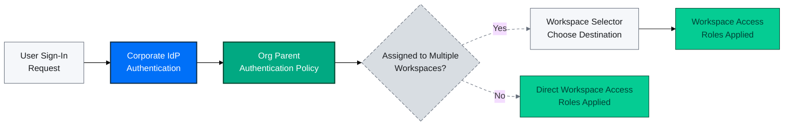
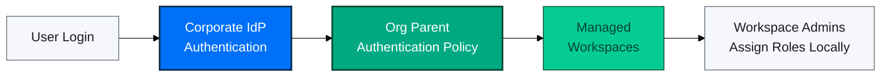
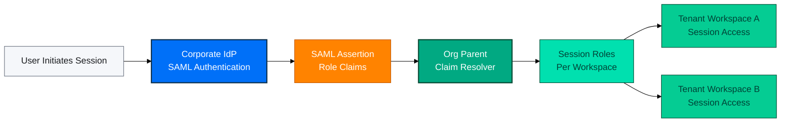
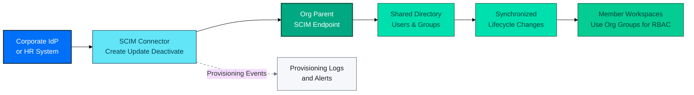
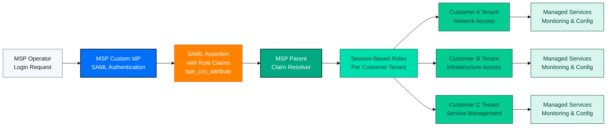

# Identity Governance Essentials

Identity governance sits at the top of the organization hierarchy. The organization
parent workspace centralizes identity so member workspaces (in enterprise hierarchies) or tenant workspaces (in MSP hierarchies) apply consistent
policies while focusing on service operations.

For workspace layout decisions, pair this guide with [Workspace Architecture Guide](/docs/greenlake/guides/public/well-architected/workspaces/workspace-architecture-guide).
For rollout plans, continue to [Migration Paths](/docs/greenlake/guides/public/well-architected/workspaces/workspaces-migration-paths).

## Why Identity Governance Matters

Identity governance eliminates unmanaged user accounts, keeps authentication modern, and
delivers audit-ready controls across every workspace. When identity is left to each
tenant or individual workspace, former employees, contractors, or partners can retain
access long after they should be removed, creating the "ungoverned user" problem.

### Governed vs. Ungoverned Access

| Capability | Ungoverned (Higher Risk) | Governed (Recommended) |
|  --- | --- | --- |
| Authentication | Users authenticate directly with personal HPE MyAccount credentials. | Users authenticate through the organization's IdP via SSO policies. |
| Account lifecycle | No central control; former staff retain access until discovered manually. | SCIM or centralized directory updates remove access instantly when roles change. |
| Visibility & audit | Limited insight into who can reach which services. | Unified directory, audit trails, and role reporting across all workspaces. |
| Compliance posture | Difficult to prove control of regulated data or operations. | Enforced policies and documented processes meet audit expectations. |
| Operational effort | Per-workspace user management and ad hoc assignments. | Group-based assignments scale across services and environments. |

Tip
Treat identity governance as part of your incident response posture. Strong domain
ownership, SSO, and SCIM shorten the window between a personnel change and access
removal, reducing the blast radius if credentials are compromised.

## Shared Responsibility Model

Identity and Access Management (IAM) in GreenLake operates under a shared responsibility model. Understanding these responsibilities ensures effective governance and security.

**GreenLake Responsibilities:**

- Provide foundational IAM capabilities including user management, role-based access control, and workspace isolation
- Maintain platform authentication infrastructure and audit logging capabilities
- Deliver SSO integration endpoints (OIDC, SAML) and SCIM provisioning APIs
- Ensure platform security

**Your Responsibilities as Administrator:**

- Configure and maintain SSO connections and authentication policies aligned with your corporate security standards
- Manage user lifecycle through SCIM provisioning or manual administration
- Assign roles and permissions based on least privilege principles
- Establish and enforce access review processes and certification workflows
- Integrate with your IGA and PAM tooling for time-bound privileged access management
- Monitor audit logs and respond to security events
- Train your team on security best practices and proper use of identity controls

## Identity Governance Pillars

Identity governance in GreenLake is composed of four pillars: domain claiming,
the shared directory, single sign-on (SSO), and SCIM automation. Together they align
with the workspace hierarchy guidance in this best practices set.

**Hierarchy Context**: This guide focuses on enterprise hierarchies where a single parent workspace and shared directory serve multiple member workspaces. MSP hierarchies operate differently: each MSP tenant maintains its own identity directory, and the MSP parent may centrally manage SSO/SCIM or delegate configuration to tenants. See [Workspace Architecture Guide - Comparing Enterprise and MSP](/docs/greenlake/guides/public/well-architected/workspaces/workspace-architecture-guide#comparing-enterprise-and-msp-organization-hierarchies) for detailed hierarchy differences.

### Identity Governance Overview

### 1. Domain Claiming

Claiming a domain establishes your organization's exclusive ownership within GreenLake and prevents unauthorized parties from impersonating your users or intercepting authentication flows. After verifying your domain through DNS TXT records, you gain exclusive control over SSO and SCIM configurations for all users in that domain, ensuring that only your administrators can define authentication policies and provisioning rules.

Domain claiming affects authentication in two scenarios:

- **Within your organization**: Workspaces belonging to your organization inherit the organization's authentication policies automatically.
- **External access**: Other organizations can create authentication policies that reference your verified domain, allowing your users to access their workspaces using your organization's SSO configuration (external domain authentication).

div
img
#### Domain claiming practices

- **Claim every domain used for user identities**: Verify ownership through DNS TXT records for all domains from which users authenticate. This establishes organizational control and enables SSO and SCIM management.
- **Flexible domain-to-SSO mapping**: You can configure multiple domains to share the same SSO connection (common for organizations with multiple brands using one IdP), or map each domain to its own dedicated SSO connection (useful for separate IdP instances or different authentication policies per domain).
- **Verification process**: Copy the TXT record from your SSO settings and provide it to your DNS administrator. After confirmation through the GreenLake UI, proceed to establish the SSO connection.
- **Track domain coverage**: Ensure new regional subsidiaries or brands are claimed before onboarding begins.

#### Advanced: Using subdomains to route users to different SSO connections

By default, GreenLake routes users to SSO connections based on their domain (the part after @). When you need users from the same parent domain to reach *different* SSO connections—whether to different IdPs or different connection configurations within the same IdP—you can claim subdomains to create distinct routing paths.

**Common scenarios requiring subdomain routing:**

- **Geographic or data residency requirements**: Global headquarters uses the parent domain (`user@example.com`) while regional operations require separate IdP instances in specific geographies (`user@emea.example.com`, `user@apac.example.com`) to comply with data sovereignty regulations
- **Workforce segmentation**: Different populations authenticate through dedicated IdPs. Employees authenticate through corporate identity systems (`user@example.com`) while contingent workers or partners use separate authentication infrastructure (`user@partner.example.com`)
- **Same IdP with different SSO modes per business unit**: Subsidiaries share a corporate IdP but require different SSO connection configurations or authorization approaches for their workspaces

**Implementation notes:**

- **Claim the subdomain**: Subdomains serve as authentication routing identifiers and do not need to correspond to actual email addresses or routable DNS names. However, you must control the parent domain to add the required DNS TXT record for verification.
- **Configure IdP claim mapping**: Configure your IdP to send the complete identifier including the subdomain (for example, `user@subdomain.example.com`) in the subject claim for OIDC (`sub` or `email` claim) or SAML (`NameID` subject). GreenLake uses this identifier to match users to the correct authentication policy and SSO connection.
- **User login experience**:
  - **SP-initiated**: Users must enter the full subdomain format (`user@subdomain.example.com`) in the GreenLake login box to reach the correct SSO connection
  - **IdP-initiated (SAML only)**: The IdP sends the assertion with the subdomain format, routing automatically

**MSP Subdomain Routing**: For MSP-specific subdomain routing patterns, see [MSP Subdomain Routing Pattern](#msp-subdomain-routing-pattern) in the MSP Identity Governance Patterns section below.

**MSP vs Enterprise**: In enterprise hierarchies, domain claiming is organization-wide (one parent, one set of domains for all member workspaces). In MSP hierarchies, an MSP may centrally claim domains in the MSP parent or enable each tenant organization to claim its own customer-specific domains, enabling strict per-customer isolation.

Limitations of Non-Routable Subdomain Identifiers
Using non-routable subdomain identifiers (pseudo-email addresses like `user@region.example.com` where the user cannot actually receive email at `user@region.example.com`) enables successful authentication but creates operational limitations:

- **Email-dependent features**: Platform email notifications, report delivery, and workspace invitations will not be delivered to users
- **Account recovery**: If you later remove the SSO connection and domain claim, users with pseudo-email addresses cannot use email verification to establish password-based login
- **SCIM provisioning**: User provisioning and group mapping from your IdP may need custom attribute mapping

For complete details on configuring domain verification, external domain policies, and
workspace-level authentication routing, see [Verified domains for SSO](https://support.hpe.com/hpesc/public/docDisplay?docId=a00120892en_us&page=GUID-69F72457-4C6C-401D-9DB0-E9E3E12BE046.html)
in the GreenLake Organization and Enhanced IAM Management guide.

### 2. Shared Directory (Enterprise Hierarchy)

div
div
In enterprise hierarchies, the organization parent owns the shared directory for users, user groups, and API clients. Member workspaces consume that directory while maintaining their own service operations.

- Create or synchronize groups once and reuse them across every member workspace.
- Assign roles to user groups instead of managing per-user access; reserve direct
user assignments for temporary or emergency scenarios.
- Use reports and audit logs to confirm that each workspace follows least
privilege boundaries.

div
img
**MSP Hierarchy Difference**: Each MSP tenant has a separate identity directory (not shared with other tenants). The MSP parent has its own directory for MSP users. Depending on the MSP's operational model, the MSP may centrally manage the tenant's directory or enable tenant administrators to manage their own users and groups. See [Workspace Architecture Guide - MSP Organizations](/docs/greenlake/guides/public/well-architected/workspaces/workspace-architecture-guide#msp-organizations) for MSP directory architecture.

Tip
When onboarding a new service, start by mapping the service's roles to existing
user groups. If you need new group granularity, add it in your IdP, let SCIM sync
the groups, and then authorize them across the relevant workspaces.

### 3. Single Sign-On Architecture

In enterprise hierarchies, configure SSO in the organization parent by defining authentication policies and connections. The platform supports multiple authentication scenarios and authorization models. The diagram below shows the general SSO authentication flow—how users authenticate through your corporate IdP and gain access to their assigned workspaces.

#### SSO Authentication Flow Overview

#### Operating Modes

Two operating modes shape how authorization is managed: **Authentication-Only SSO** and **SAML Authorization Mode**. The diagram below depicts the differences between these modes side by side:

**Recommendation:** For most use cases, Authentication-Only mode with OIDC provides better interoperability and scalability. This approach implements separation of concerns by decoupling authentication from authorization, avoiding the complexity of custom SAML attribute mapping. Instead, assign roles to directory-managed groups and synchronize them to GreenLake using SCIM provisioning to reduce configuration errors and enable automated user lifecycle management. Integrate this with your Identity Governance and Administration (IGA) or Privileged Access Management (PAM) tooling to enforce least privilege access through centralized group membership management.

Tip
Authentication-Only mode is typically easier to manage and provides better visibility than using custom IdP claim mapping logic.

##### Authentication-Only SSO

Your corporate IdP verifies user identity through the SSO connection, and the GreenLake organization authentication policy determines which workspaces require SSO authentication to be accessed. After authentication, workspace administrators control what each user can do by assigning specific roles and permissions within their workspaces. This separates authentication (proving who you are) from authorization (controlling what you can access).

**Best for**: Organizations where multiple teams manage independent service operations with different access requirements. Identity administrators configure SSO once at the organization level and then delegate day-to-day access control to workspace administrators who manage roles and permissions without requiring IdP configuration changes.

##### SSO Authorization Mode

Your IdP handles both authentication and authorization, sending role claims with each login session using the `hpe_ccs_attribute` SAML claim. GreenLake grants workspace access dynamically based on these session-specific roles.

**Best for**: MSP environments with large network operations centers and the ability to manage custom SAML claims at scale. Unlike Authentication-Only mode, this approach centralizes all access control decisions at the IdP level. Identity administrators manage both authentication and authorization without delegating to workspace administrators.

Important
SSO Authorization Mode requires careful evaluation before implementation:

- **Operational complexity**: Requires significant coordination between identity teams and service owners, plus tolerance for maintaining custom SAML claim mappings
- **Configuration errors**: Text mapping and scripting mistakes in claim transformations can inadvertently lock users out of workspaces or grant incorrect permissions, and troubleshooting silent failures in claim resolution is significantly more difficult than diagnosing explicit role assignment issues in Authentication-Only mode
- **Maintenance overhead**: Creating custom roles in GreenLake requires corresponding updates to your IdP's claim mapping configuration, creating ongoing synchronization requirements
- **Session limitations**: Platform and SAML protocol limits restrict the number of simultaneous roles per session, making this approach most viable when users need access to only a few role definitions across a limited number of workspaces at any given time

#### SSO Configuration Best Practices

**Configuration practices:**

- Enforce authentication policies in your Identity Provider (IdP) that align with your organization's security baseline, including adaptive multi-factor authentication (MFA), device trust attestation, and conditional access based on network location or risk signals.
- Choose OIDC for most implementations. OIDC is faster to configure than SAML and handles security certificate updates automatically, reducing the risk of login interruptions in the future. Use SAML only if your Identity Provider (IdP) does not support OIDC or if your internal security policies require it.
- Leverage standard identity claims for SSO and rely on in-platform role assignments through SCIM-synchronized groups to simplify configuration and maintain separation of concerns between authentication and authorization.
- For SAML authorization mode deployments, define precise attribute mappings for workspace and role claims in your IdP's service provider configuration, and implement monitoring to detect claim resolution failures that could result in unauthorized access or access denials.

**MSP Hierarchy Flexibility**: MSP hierarchies offer additional SSO management flexibility. The MSP parent may centrally configure SSO connections for all tenants or delegate SSO configuration to individual tenant administrators for co-managed scenarios. Some large MSPs use fully centralized SSO-based authorization without granting tenants direct configuration access. See [Workspace Architecture Guide - MSP Organizations](/docs/greenlake/guides/public/well-architected/workspaces/workspace-architecture-guide#msp-organizations) for MSP delegation patterns.

If you must route users with the same primary email domain to different IdPs or
conditional flows, create logical subdomains (for example, `bob@us.organization.com`
and `carlos@eu.organization.com`). Map those identifiers in your IdP before they
reach GreenLake so each user lands on the correct SSO connection.

For complete details on supported SSO configurations, authentication policy types,
and workspace applicability, see [Configuring SSO using authentication policies](https://support.hpe.com/hpesc/public/docDisplay?docId=a00120892en_us&page=GUID-8315DD2B-CD45-4305-9323-3F573EDAF3B9.html)
in the GreenLake Organization and Enhanced IAM Management guide.

### 4. SCIM Automation

SCIM (System for Cross-domain Identity Management) automates user and group lifecycle
management between your authoritative identity sources and GreenLake. When
employees join, change roles, or leave, SCIM synchronizes those changes automatically,
eliminating manual provisioning and deprovisioning across workspaces. Combined with group-based role assignments, SCIM ensures authorization follows identity lifecycle events automatically, maintaining least privilege access and reducing security exposure from stale accounts.

**Enterprise vs MSP**: In enterprise hierarchies, SCIM provisions to the organization-wide shared directory. In MSP hierarchies, SCIM can be configured at the MSP parent level (centralized provisioning). Check the latest [MSP configuration documentation](https://support.hpe.com/hpesc/public/docDisplay?docId=a00120892en_us&page=GUID-A5280334-DBD5-480E-9FFF-121E81A34D72_2.html) to determine if per-tenant delegated SCIM provisioning is available.

#### SCIM Provisioning Flow

#### SCIM best practices

- **Establish SCIM as the system of record**: Make all identity changes in your authoritative source (IdP, PAM, IGA, or HR system) and use SCIM to synchronize them to GreenLake. Avoid manual changes in GreenLake that could create identity drift.
- **Implement continuous monitoring**: Configure real-time alerts on provisioning failures and synchronization errors. Review provisioning logs regularly to identify and remediate orphaned accounts or stale group memberships.
- **Enforce group-based access control**: Assign roles exclusively to synchronized groups rather than individual users. This ensures access automatically reflects organizational changes (joiners, movers, leavers) without manual intervention.
- **Protect emergency access**: Maintain dedicated break-glass accounts outside SCIM management for disaster recovery scenarios. Store credentials in a privileged access vault and audit all emergency account usage.

#### SCIM APIs

For complete API specifications, see [SCIM API](/docs/greenlake/services/scim/).

## MSP Identity Governance Patterns

Managed Service Provider (MSP) hierarchies fundamentally differ from enterprise hierarchies in identity architecture. While enterprise organizations use a single shared directory across all tenants, each MSP tenant maintains its own independent identity directory—even when the MSP parent centrally manages authentication and provisioning.

### Key MSP vs Enterprise Differences

| Aspect | Enterprise Hierarchy | MSP Hierarchy |
|  --- | --- | --- |
| **Domain claiming** | Organization-wide (one parent, one set of domains) | Flexible: MSP may centrally claim domains or enable per-tenant claiming |
| **SSO configuration** | Centralized at parent for all member workspaces | Flexible: MSP can manage centrally or delegate per tenant |
| **SCIM provisioning** | Organization-wide provisioning to shared directory | Centralized (MSP parent); per-tenant (delegated) not currently available |
| **User management** | Workspace admins assign roles to organization users and groups | Users managed by either MSP parent or tenant (not both) |

See [Workspace Architecture Guide - Comparing Enterprise and MSP](/docs/greenlake/guides/public/well-architected/workspaces/workspace-architecture-guide#comparing-enterprise-and-msp-organization-hierarchies) for complete hierarchy comparison.

### MSP Operational Models

- **Centralized model**: The MSP parent claims customer domains, configures SSO and SCIM,
and assigns roles to MSP-controlled groups. Tenants receive governed access without
identity administration responsibilities. Large MSPs often use fully centralized SSO-based authorization without granting tenants any direct configuration access.
- **Delegated model**: The MSP may enable tenant administrators to claim their own domains and manage their own authentication policy. Alternatively, the MSP parent may claim domains centrally but grant tenant operators scoped permissions to configure SSO and RBAC. Use this for co-managed offerings where tenant admins handle day-to-day administration of their users.
- **Per-session RBAC**: When MSP operators need time-bound or customer-specific access,
issue SAML role claims per session to avoid persistent privileged assignments.

#### Example: MSP Centralized Authorization Mode

The diagram below illustrates how an MSP uses SAML authorization mode to centrally manage access across multiple tenant workspaces. The MSP's corporate IdP injects session-specific role claims that grant MSP operators secure access to their customers' networks and services based on dynamic evaluation within the MSP provider's platform, enabling standardized configurations and SLA adherence while maintaining visibility and control.

This centralized pattern empowers the MSP to fully own identity and infrastructure management while providing customer tenants secure, auditable views into their specific networks and services without relinquishing control.

#### MSP Subdomain Routing Pattern

Managed service providers may choose to segregate three distinct user populations through subdomain-based routing, with different SSO modes for each:

- **MSP operators** (`user@msp.example.com`): Service delivery teams authenticate through a dedicated MSP IdP using **SAML Authorization Mode**, enabling session-based role claims for time-bound access to customer tenant workspaces
- **MSP customer end users** (`user@tenants.msp.example.com`): End users of the MSP's customers access GreenLake by authenticating through the MSP's platform. They first authenticate to the MSP using their own credentials. The MSP then federates them into GreenLake through the MSP's claimed domain and IdP via **SAML Authorization Mode**. The MSP parent centrally manages the SSO connection and claim mappings for standardized service delivery
- **MSP internal users** (`user@example.com`): When the MSP uses GreenLake for its own internal enterprise operations (separate from customer service delivery), internal staff authenticate through the corporate IdP using **Authentication-Only mode** with group-based RBAC

## Operational Guardrails

Build the following guardrails into your operating model so identity governance stays effective as you scale. As outlined in the [Shared Responsibility Model](#shared-responsibility-model), these capabilities are implemented through your corporate IdP, IGA platform, PAM solution, and SIEM (not provided by GreenLake). The platform delivers the integration points (SSO, SCIM, audit logs). You configure and operate the identity infrastructure that enforces these controls.

- **Enforce risk-based authentication**: Require phishing-resistant multi-factor authentication (FIDO2, hardware security keys, or certificate-based authentication) for all privileged operations. Implement adaptive authentication policies in your IdP that evaluate device trust, network location, and user behavior to dynamically adjust authentication requirements based on risk signals.
- **Leverage IGA and PAM tooling for privileged access**: Use your Identity Governance and Administration (IGA) platform to manage group-based role assignments and enforce time-bound access through dynamic group membership. Integrate your Privileged Access Management (PAM) solution to orchestrate temporary elevation workflows. Add users to privileged groups for approved time windows and then automatically remove them when the access period expires. This approach maintains least privilege while adapting to operational requirements for elevated access.
- **Implement continuous access certification**: Schedule periodic access reviews for all role assignments and group memberships across workspaces. Automate review workflows through your IGA platform and require explicit manager approval to retain access. Document all certification decisions with business justification for audit compliance. Monitor for access creep by comparing current assignments against role baselines and approved entitlement matrices.
- **Establish comprehensive audit and monitoring**: Export audit logs to your SIEM platform for correlation with other security events. Configure real-time alerts for high-risk activities including authentication policy changes, SCIM provisioning failures, and domain claim modifications.
- **Maintain domain claim inventory**: Track all claimed domains and subdomains in your configuration management database (CMDB) alongside ownership, verification method, and last validation date. Implement automated monitoring to detect expiring DNS TXT records before domain claims become invalid. Establish processes to evaluate domain requirements during mergers, acquisitions, divestitures, and brand changes to prevent identity governance gaps.
- **Protect emergency access paths**: Maintain dedicated break-glass accounts with direct authentication (bypassing SSO and SCIM) for disaster recovery scenarios when your corporate IdP or SCIM infrastructure is unavailable. Store break-glass credentials in a hardware security module (HSM) or privileged access vault with strict access controls and multi-person authorization. Test break-glass procedures quarterly to validate functionality. Configure immediate alerts and initiate incident response workflows for any break-glass account usage.

## Procedures and Next Steps

Refer to the **GreenLake Organization and Enhanced IAM Management** guide for
step-by-step tasks, including:

- Claiming domains and verifying DNS TXT records.
- Creating authentication policies and SSO connections.
- Configuring SCIM connectors, testing provisioning, and monitoring health.
- Managing scope groups, custom roles, and delegated administration.

**Terminology Update**: Authentication policies and connections replace the legacy term "SSO profiles."

Return to [Workspace Architecture Guide](/docs/greenlake/guides/public/well-architected/workspaces/workspace-architecture-guide) to confirm
your hierarchy design, or continue to [Migration Paths](/docs/greenlake/guides/public/well-architected/workspaces/workspaces-migration-paths)
when you are ready to align existing workspaces with these practices.