# Migrating to Workspace Architecture Best Practices

This guide provides migration paths for adopting the [workspace architecture best practices](/docs/greenlake/guides/public/well-architected/workspaces).
Whether you're starting from a brand-new tenancy or managing
long-standing workspaces, the steps below help you align with the recommended organization hierarchy.

For background on workspace types and hierarchy patterns, see [Workspace Architecture Guide](/docs/greenlake/guides/public/well-architected/workspaces/workspace-architecture-guide).
For identity governance details, see [Identity Governance](/docs/greenlake/guides/public/well-architected/workspaces/identity-governance).

Need a refresher on why the hierarchy matters before committing to a path? Revisit the [Best Practices overview](/docs/greenlake/guides/public/well-architected/workspaces) for the executive summary and benefits recap.

## Quick Decision Table

Use this table to match your current footprint to the right migration path. Each section below expands on triggers, prerequisites, and execution steps.

| Current State | Goal | Path to Use | Why It's Right |
|  --- | --- | --- |
| **Starting point:** You have not created a GreenLake workspace yet.  **Goal:** Explore services quickly before committing to identity governance. | Start with a standalone workspace and plan an organization parent or MSP hierarchy once you require centralized governance. See [Path 1](#path-1-brand-new-deployments-requiring-organization-identity). | Matches the lightweight onboarding pattern while preserving a path to the hierarchy. |
| **Starting point:** You already know you need user groups, SSO, SCIM, or multiple teams need separate workspaces.  **Goal:** Launch with centralized identity from day one. | Create an enterprise organization parent and add member workspaces for each environment. See [Path 1](#path-1-brand-new-deployments-requiring-organization-identity). | Enabling the organization identity directory unlocks user groups, SSO, and SCIM together while keeping services out of the parent workspace. |
| **Starting point:** You run a standalone workspace with no services yet.  **Goal:** Promote it to the parent and add member workspaces without reprovisioning. | Convert the workspace into an organization parent, then create member workspaces. See [Path 2](#path-2-standalone-workspace-without-services). | No service rework required, and identity remains unchanged. |
| **Starting point:** A standalone workspace already hosts services and still uses non-federated HPE MyAccount users.  **Goal:** Gain centralized governance without interrupting those services. | Create a new organization parent, keep the existing workspace as a tenant, and migrate identity settings. See [Path 3](#path-3-standalone-workspace-with-services-no-sso-or-enhanced-iam-enabled). | Avoids service downtime while introducing organization identity. |
| **Starting point:** An enterprise organization parent runs services directly and no member workspaces exist yet.  **Goal:** Determine how to align with the member workspace architecture without disrupting services. | Engage HPE to evaluate legacy service placement and plan the transition. See [Path 4](#path-4-organization-parent-with-services-no-tenants). | Advanced scenario that requires guided migration support. |
| **Starting point:** An enterprise organization parent runs services directly and already has member workspaces.  **Goal:** Realign parent and member workspace responsibilities while keeping services available. | Engage HPE to assess member workspace hierarchy changes and identity impacts. See [Path 5](#path-5-organization-parent-with-services-and-tenants). | Advanced scenario that requires guided migration support. |
| **Starting point:** You manage multiple customer workspaces that rely on MSP-supported services and need strict tenant isolation.  **Goal:** Maintain centralized oversight while keeping each tenant segmented. | Evaluate MSP hierarchy enablement with HPE guidance. See [Path 6](#path-6-msp-hierarchy-adoption). | MSP mode combines centralized management with tenant isolation for supported services. |

Tip
If you need user groups for role assignments, SSO, or SCIM, adopt an enterprise organization parent. Enabling the organization identity directory gives you all three capabilities together, and you can activate whichever combination fits each member workspace.

## Before You Begin

1. Inventory every workspace, noting whether it already belongs to an organization and
whether services are provisioned.
2. Confirm which services require aggregation features or MSP capabilities.
3. Gather identity ownership information (domains, identity providers, and SCIM endpoints).
4. Decide who will own the organization parent workspace.

The **GreenLake Organization and Enhanced IAM Management** guide contains the
definitive checklists for domain claiming, SSO, and SCIM configuration. Use it for the
field-by-field instructions during your migration.

## Path 1: Brand-New Deployments Requiring Organization Identity

Choose this path when you are starting fresh and want centralized identity in place before provisioning any services.

### Path 1: When to Choose

- You have no existing GreenLake workspaces and are ready to create the hierarchy from scratch.
- You want user groups, SSO, or SCIM enabled immediately so every tenant inherits centralized identity.

### Path 1: Prerequisites

- Identity team is prepared to claim domains, configure SSO, and optionally enable SCIM.
  - Note: Domain claiming is not required if you only want to start with local user groups.
- Stakeholders agree on the initial tenant layout (production, non-production, different teams, etc.).

### Path 1: Steps

1. Create a fresh organization parent workspace.
2. Configure the organization identity directory: claim domains, set up SSO, and enable SCIM (if you are not relying solely on local users and user groups).
3. Add member workspaces for each environment or service grouping you plan to operate.
4. Provision services and onboard devices only in member workspaces.
5. Transition access management to user groups once the member workspaces are active.
  - If many users share the same roles, convert per-user assignments to user groups and follow the SCIM guidance in [Identity Governance](/docs/greenlake/guides/public/well-architected/workspaces/identity-governance).

## Path 2: Standalone Workspace without Services

Choose this path when your standalone workspace is empty and you want to promote it into the organization hierarchy without reprovisioning.

```mermaid
%%{init: {'theme': 'base'}}%%
graph LR
   accTitle: Path 2 - Standalone Workspace without Services
   accDescr: Convert a standalone workspace into the organization parent, configure identity, add member workspaces, and centralize role assignment.
   A[Standalone Workspace]:::tenant --> B[Enable Org Capabilities]:::parent --> C[Configure Domain & SSO]:::identity --> D[Create Member Workspaces]:::tenant --> E[Assign Roles via User Groups]:::service
   classDef parent fill:#01A982,color:#FFFFFF,stroke:#292D3A,stroke-width:2px;
   classDef identity fill:#62E5F6,color:#292D3A,stroke:#292D3A;
   classDef tenant fill:#05CC93,color:#292D3A,stroke:#292D3A;
   classDef service fill:#0070F8,color:#FFFFFF,stroke:#292D3A;
```

### Path 2: When to Choose

- You have a standalone workspace with zero services provisioned.
- You want to enable organization management without creating a new parent workspace.

### Path 2: Prerequisites

- Organization management features are not yet enabled on the workspace.
- Identity owners are ready to configure domain claiming, SSO, and SCIM immediately after promotion.

### Path 2: Steps

1. Enable organization capabilities on the existing workspace so it becomes the parent.
2. Configure domain claiming, SSO, and SCIM once the organization is active.
3. Add member workspaces for each environment.
4. Assign roles to user groups instead of managing access per user.
5. Keep services out of the parent and continue provisioning only in member workspaces.
6. Transition per-user assignments to user groups and manage them with SCIM as outlined in [Identity Governance](/docs/greenlake/guides/public/well-architected/workspaces/identity-governance).

Tip
Because the original workspace did not host any services, no migrations are required during this conversion.

## Path 3: Standalone Workspace with Services (no SSO or enhanced IAM enabled)

Choose this path when your standalone workspace already runs services and you want to join the hierarchy without downtime.

Important
Use this path only when the existing workspace has never been enabled for organization identity. If the services currently run in an organization parent, follow Path 4. If you are migrating a legacy workspace that already carries SSO from the pre-Enhanced IAM era, use Path 5 instead.

```mermaid
%%{init: {'theme': 'base'}}%%
graph LR
   accTitle: Path 3 - Standalone Workspace with Services
   accDescr: Establish a new organization parent, optionally configure SSO, join the existing workspace as a member workspace, and keep services running.
   A[Existing Workspace + Services]:::service --> B[Create Org Parent]:::parent --> C[Optional:<br/>Configure SSO in Parent]:::identity --> D[Join Workspace as Member]:::tenant --> E[Optional:<br/>Add Members or Redistribute Services]:::neutral
   classDef parent fill:#01A982,color:#FFFFFF,stroke:#292D3A,stroke-width:2px;
   classDef identity fill:#62E5F6,color:#292D3A,stroke:#292D3A;
   classDef tenant fill:#05CC93,color:#292D3A,stroke:#292D3A;
   classDef service fill:#0070F8,color:#FFFFFF,stroke:#292D3A;
   classDef neutral fill:#E6E8E9,color:#292D3A,stroke:#292D3A;
```

### Path 3: When to Choose

- Your standalone workspace currently provisions services using HPE MyAccount authentication.
- You need organization identity but want to keep those services running during the transition.

### Path 3: Prerequisites

- No organization identity features (authentication policy, SSO connections, SCIM) are currently enabled.
- Identity team has a plan for SSO, SCIM, and domain ownership when the parent comes online.

### Path 3: Steps

1. Create a new organization parent workspace.
2. Decide when to introduce SSO:
  - If enabling SSO now, create the authentication policy and connection in the parent, claim required domains, configure SCIM if needed, and update IdP assignments so HPE MyAccount users transition smoothly.
  - If deferring SSO, continue using HPE MyAccount until your identity team is ready.
3. Join the existing standalone workspace to your new organization parent workspace.
4. Add additional member workspaces and redistribute services as needed.
5. Migrate per-user assignments to user groups and enable SCIM per the guidance in [Identity Governance](/docs/greenlake/guides/public/well-architected/workspaces/identity-governance).

Caution
When configuring SSO, verify that your IdP allows every user from claimed domains who currently needs access, and confirm whether you will run in authentication-only mode or SAML authorization mode. Review [Identity Governance Essentials](/docs/greenlake/guides/public/well-architected/workspaces/identity-governance) for details on these modes before switching production users.

When in doubt, stay with authentication-only SSO. Aligning that guidance across this guide and [Identity Governance Essentials](/docs/greenlake/guides/public/well-architected/workspaces/identity-governance) keeps authorization changes manageable until you have a clear per-session requirement.

This approach avoids downtime and prepares you for future service rollouts.

## Path 4: Organization Parent with Services (No Tenants)

Choose this path when an enterprise organization parent runs services intended for member workspaces but no member workspaces have been created yet. Organization identity (SSO, SCIM) may or may not already be configured. Because this is a legacy configuration with multiple remediation options, work with HPE experts before making changes.

```mermaid
%%{init: {'theme': 'base'}}%%
graph LR
   accTitle: Path 4 - Org Parent Services, No Tenants (Advanced)
   accDescr: Document the current parent configuration, consult HPE, evaluate remediation options, and plan a guided transition.
   A[Capture Current Parent State]:::service --> B[Engage HPE Account/Support]:::parent --> C[Review Identity & Service Options]:::identity --> D[Plan Member Workspace Creation Strategy]:::tenant --> E[Await Guided Remediation]:::neutral
   classDef service fill:#0070F8,color:#FFFFFF,stroke:#292D3A;
   classDef parent fill:#01A982,color:#FFFFFF,stroke:#292D3A,stroke-width:2px;
   classDef identity fill:#62E5F6,color:#292D3A,stroke:#292D3A;
   classDef tenant fill:#05CC93,color:#292D3A,stroke:#292D3A;
   classDef neutral fill:#E6E8E9,color:#292D3A,stroke:#292D3A;
```

### Path 4: When to Choose

- **Services in parent, no member workspaces:** the organization parent directly hosts services that should ultimately reside in member workspaces.
- **Identity state varies:** SSO and SCIM may or may not already be enabled, and you need help reconciling the current configuration.
- **Guided remediation required:** you prefer an expert-assisted plan to avoid downtime while introducing member workspaces.

### Path 4: Prerequisites

- **Service inventory documented:** capture which services, devices, and integrations currently run in the parent workspace.
- **HPE contact engaged:** confirm an HPE account team or GreenLake support representative is available to advise on remediation options.

### Path 4: Steps

1. Share the current organization parent configuration (services, integrations, identity settings) with your HPE account team or support contact.
2. Review remediation options together, including member workspace creation sequencing, service migration tooling, and identity adjustments.
3. Develop a transition plan that aligns with maintenance windows and risk tolerances.
4. Execute changes under HPE guidance when the recommended path is available.

This advanced scenario does not yet have a one-size-fits-all playbook. Coordinating with your HPE contacts ensures you receive the latest remediation guidance and tooling support.

## Path 5: Organization Parent with Services and Tenants

Choose this path when an enterprise organization parent hosts services that should live in member workspaces and member workspaces already exist beneath it. Organization identity (SSO, SCIM) may or may not already be configured. Because parent and member workspace responsibilities are intertwined, coordinate with HPE before changing the hierarchy.

```mermaid
%%{init: {'theme': 'base'}}%%
graph LR
   accTitle: Path 5 - Org Parent Services with Tenants (Advanced)
   accDescr: Assess parent and member workspace usage, consult HPE, evaluate member workspace realignment options, and schedule supported remediation.
   A[Assess Parent & Member Workspace Usage]:::service --> B[Engage HPE Account/Support]:::parent --> C[Review Identity & Member Dependencies]:::identity --> D[Plan Member Realignment]:::tenant --> E[Execute with HPE Guidance]:::neutral
   classDef service fill:#0070F8,color:#FFFFFF,stroke:#292D3A;
   classDef parent fill:#01A982,color:#FFFFFF,stroke:#292D3A,stroke-width:2px;
   classDef identity fill:#62E5F6,color:#292D3A,stroke:#292D3A;
   classDef tenant fill:#05CC93,color:#292D3A,stroke:#292D3A;
   classDef neutral fill:#E6E8E9,color:#292D3A,stroke:#292D3A;
```

### Path 5: When to Choose

- **Services in parent plus member workspaces:** the organization parent runs services while member workspaces already exist, leading to shared responsibilities.
- **Identity state varies:** SSO and SCIM may or may not be active, and you need help untangling ownership across the hierarchy.
- **Guided remediation required:** coordinated planning is needed to keep member workspaces available while realigning services.

### Path 5: Prerequisites

- **Member workspace dependency map:** document which member workspaces rely on parent-hosted services and any cross-member integrations.
- **HPE contact engaged:** confirm an HPE account team or GreenLake support representative is ready to assist.

### Path 5: Steps

1. Share a consolidated view of parent-hosted services, member workspace dependencies, and identity settings with your HPE contacts.
2. Evaluate remediation options together, including staged service moves, member workspace hierarchy adjustments, and identity changes.
3. Build a timeline that protects member workspace availability and communicates required maintenance windows.
4. Execute the agreed plan under HPE guidance when the recommended tooling and procedures are available.

This configuration involves multiple member workspaces and shared services, so remediation steps depend on the specific combination of services, identity modes, and member workspace usage. Engage your HPE contacts for the latest supported approach.

## Path 6: MSP Hierarchy Adoption

Choose this path when you need tenant isolation and centralized management for MSP-supported services. In-depth capabilities and current limitations are documented in the [Managed Service Provider (MSP) Mode - User Guide](https://support.hpe.com/hpesc/public/docDisplay?docId=a00120892en_us&page=GUID-A5280334-DBD5-480E-9FFF-121E81A34D72_2.html).

```mermaid
%%{init: {'theme': 'base'}}%%
graph LR
   accTitle: Path 6 - MSP Hierarchy Adoption (Advanced)
   accDescr: Assess MSP requirements, engage HPE contacts, review the MSP mode guide, and plan tenant isolation while awaiting further enablement guidance.
   A[Assess MSP Needs]:::neutral --> B[Engage HPE Team]:::parent --> C[Review MSP Guide]:::identity --> D[Plan Tenant Isolation]:::tenant --> E[Await Further Guidance]:::service
   classDef neutral fill:#E6E8E9,color:#292D3A,stroke:#292D3A;
   classDef parent fill:#01A982,color:#FFFFFF,stroke:#292D3A,stroke-width:2px;
   classDef identity fill:#62E5F6,color:#292D3A,stroke:#292D3A;
   classDef tenant fill:#05CC93,color:#292D3A,stroke:#292D3A;
   classDef service fill:#0070F8,color:#FFFFFF,stroke:#292D3A;
```

### Path 6: When to Choose

- **Tenant isolation required:** you operate multiple customer workspaces that depend on MSP-supported services and must keep each tenant segmented.
- **Centralized top-down management:** you want MSP administrators to maintain oversight of tenant workspaces and supported services from a single control point.
- **Advanced engagement:** contact your HPE account team or GreenLake support before enabling MSP mode.

### Path 6: Prerequisites

- **Supported services confirmed:** verify that your required offerings are covered by MSP mode (for example Aruba Networking Central, Compute Ops Management, OpsRamp, and other services listed in the official guide).
- **HPE guidance in place:** an HPE account team or support contact is ready to guide the enablement process.

### Path 6: Steps

1. Contact your HPE account team or GreenLake support to validate MSP mode eligibility, supported services, and enablement timelines.
2. Review the [Managed Service Provider (MSP) Mode - User Guide](https://support.hpe.com/hpesc/public/docDisplay?docId=a00120892en_us&page=GUID-A5280334-DBD5-480E-9FFF-121E81A34D72_2.html) together to align on current capabilities and tenant isolation patterns.
3. Document tenant segmentation outcomes, identity expectations, and service placement with your HPE contacts before proceeding.
4. Await additional enablement guidance; this guide will be updated with detailed implementation steps as soon as they are available.

Detailed MSP hierarchy enablement guidance is forthcoming. Engage your HPE account team or support contact for the latest recommendations and updates.

Return to the [Best Practices overview](/docs/greenlake/guides/public/well-architected/workspaces) for a refresher on the hierarchy
benefits and adoption roadmap, or review [Workspace Architecture Guide](/docs/greenlake/guides/public/well-architected/workspaces/workspace-architecture-guide) for
detailed comparisons of enterprise and MSP architectures.