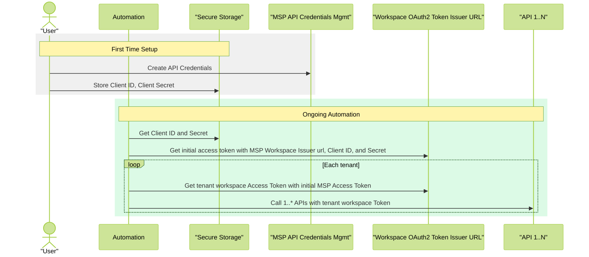

# MSP access token exchange

Managed Service Providers (MSPs) operating in HPE GreenLake Cloud can use OAuth 2.0 Token Exchange to streamline access across multiple tenant workspaces. This document explains how to implement token exchange to efficiently manage API access across your managed tenant environments.

## Background

### Understanding workspace token scoping

In HPE GreenLake Cloud, each workspace requires an access token with specific scoping to that workspace. Without token exchange, you would need to:

* Create separate API client credentials in each workspace.
* Maintain multiple sets of credentials.
* Obtain separate tokens for each workspace when needed.


For more foundational information, see the [token generation guide](/docs/greenlake/services/credentials/public#developer-guide).

### Token exchange process

HPE GreenLake Cloud implements [RFC 8693: OAuth 2.0 Token Exchange](https://datatracker.ietf.org/doc/html/rfc8693), allowing MSPs to:

1. Create a **single set** of API client credentials in their MSP workspace.
2. Generate an MSP workspace-scoped access token.
3. Exchange that token for tenant-specific tokens as needed.


This implementation follows OAuth 2.0 standards for requesting and obtaining security tokens from an authorization server issuer and exchanging them for tokens from other trusted issuers.

## How token exchange works

The following diagram illustrates the token exchange workflow for MSP automation:




### Target workspace OAuth2 issuer format

The target workspace issuer URL follows this pattern:


```text
https://<HPE_Cloud_Base_URL>/authorization/v2/oauth2/<Target Workspace ID>/token
```

For example:


```text
https://global.api.greenlake.hpe.com/authorization/v2/oauth2/{TARGET_WORKSPACE_ID}/token
```

The workspace ID used in token exchange requests must be formatted as hexadecimal with no hyphens. For example, use `a1b2c3d4e5f6a7b8c9d0e1f2a3b4c5d6` instead of `a1b2c3d4-e5f6-a7b8-c9d0-e1f2a3b4c5d6`.

### Step 1: Generate an MSP access token

First, generate an access token for your MSP workspace using your API client credentials.

#### Prerequisites

* API client credentials (client ID and secret) created in your MSP workspace
* The issuer URL for your MSP workspace
* Secure storage for these credentials


#### API request

Make an HTTP POST request to the issuer's `/token` endpoint using the OAuth2 client credentials grant.

#### Request example (cURL)

This example assumes the following variables have been set or replaced:

* `MSP_WORKSPACE_ID`: The unique identifier of your MSP parent workspace.
* `MSP_CLIENT_ID`: The client credential ID associated with your MSP account.
* `MSP_CLIENT_SECRET`: The client credential secret for authentication.


```bash
curl \
  -r POST "https://global.api.greenlake.hpe.com/authorization/v2/oauth2/$MSP_WORKSPACE_ID/token" \
  -d "client_id=$MSP_CLIENT_ID" \
  -d "client_secret=$MSP_CLIENT_SECRET" \
  -d 'grant_type=client_credentials' \
  -H "User-Agent: get-token-curl-example" \
  -H "Content-Type: application/x-www-form-urlencoded" \
| jq -r '.access_token'
```

The response will be a JSON object with the access token in the `access_token` property. In the example above, the response is piped to the `jq` tool to extract this value. For more details, see the [OAuth2 access token response documentation](https://www.oauth.com/oauth2-servers/access-tokens/access-token-response/).

details
summary
Go Implementation

```go
func token(id, secret, iss, scope string) (string, error) {
  form := url.Values{}
  form.Add("grant_type", "client_credentials")
  form.Add("client_id", id)
  form.Add("client_secret", secret)
  form.Add("scope", scope)
  tokenEndpoint := iss + "/token"
  req, err := http.NewRequest(http.MethodPost, tokenEndpoint, strings.NewReader(form.Encode()))
  if err != nil {
    return "", err
  }

  req.Header.Add("Content-Type", "application/x-www-form-urlencoded")

  resp, err := httpClient.Do(req)
  if err != nil {
    return "", err
  }

  if resp.StatusCode != 200 {
    return "", fmt.Errorf("invalid status code: %v\n", resp.StatusCode)
  }

  body, err := io.ReadAll(resp.Body)
  defer resp.Body.Close()

  if err != nil {
    return "", err
  }

  var tokenOutput TokenResponse
  err = json.Unmarshal([]byte(body), &tokenOutput)

  if err != nil {
    return "", fmt.Errorf("invalid token: %v\n", err)
  }

  return tokenOutput.AccessToken, nil
}
```

### Step 2: Exchange for tenant access token

Once you have an MSP access token, you can exchange it for tenant-specific tokens.

#### API request

Use the OAuth 2.0 token exchange grant type to exchange your MSP token for a tenant-specific token.

#### Request example (cURL)

This example assumes the following variables have been set or replaced:

* `TENANT_WORKSPACE_ID`: The unique identifier of your MSP **Tenant** workspace.
* `MSP_ACCESS_TOKEN`: The MSP parent access token obtained in step 1.


```bash
curl \
  -r POST "https://global.api.greenlake.hpe.com/authorization/v2/oauth2/$TENANT_WORKSPACE_ID/token" \
  -d "subject_token=$MSP_ACCESS_TOKEN" \
  -d 'grant_type=urn:ietf:params:oauth:grant-type:token-exchange' \
  -d 'subject_token_type=urn:ietf:params:oauth:token-type:access_token'\
  -H "User-Agent: exchange-token-curl-example" \
  -H 'Content-Type: application/x-www-form-urlencoded' \
| jq -r '.access_token'
```

The response will be a JSON object with the access token in the `access_token` property. In the example above, the response is piped to the `jq` tool to extract this value. For more details, see the [OAuth2 access token response documentation](https://www.oauth.com/oauth2-servers/access-tokens/access-token-response/).

details
summary
Go Implementation

```go
func exchange(token string, iss string) (string, error) {
  grant_type := "urn:ietf:params:oauth:grant-type:token-exchange"
  token_type := "urn:ietf:params:oauth:token-type:access_token"

  form := url.Values{}
  form.Add("grant_type", grant_type)
  form.Add("subject_token", token)
  form.Add("subject_token_type", token_type)

  req, err := http.NewRequest(http.MethodPost, iss, strings.NewReader(form.Encode()))
  if err != nil {
    return "", err
  }

  req.Header.Add("Content-Type", "application/x-www-form-urlencoded")

  resp, err := httpClient.Do(req)
  if err != nil {
    return "", err
  }

  if resp.StatusCode != 200 {
    return "", fmt.Errorf("invalid status code: %v\n", resp.StatusCode)
  }

  body, err := io.ReadAll(resp.Body)
  defer resp.Body.Close()

  if err != nil {
    return "", err
  }

  var tokenOutput TokenResponse
  err = json.Unmarshal([]byte(body), &tokenOutput)

  if err != nil {
    return "", fmt.Errorf("invalid token exchange: %v\n", err)
  }

  return tokenOutput.AccessToken, nil
}
```

details
summary
Python Implementation

```python
import requests, os, sys

def get_token(id: str, secret: str, iss: str, scope: str) -> str:
    data = {
        "grant_type": "client_credentials",
        "client_id": id,
        "client_secret": secret,
        "scope": scope
    }
    token_endpoint = iss + "/token"

    return post_and_extract_token(url=token_endpoint, data=data)

def exchange_token(token: str, iss: str) -> str:
    grant_type = "urn:ietf:params:oauth:grant-type:token-exchange"
    token_type = "urn:ietf:params:oauth:token-type:access_token"

    data = {
        "grant_type": grant_type,
        "subject_token": token,
        "subject_token_type": token_type,
    }

    return post_and_extract_token(url=iss, data=data)

def post_and_extract_token(url, data) -> str:
    try:
        response = requests.post(url=url, data=data)  # Using data arg. implicitly sets "Content-Type" to "application/x-www-form-urlencoded"
        if response.status_code != 200:
            raise requests.exceptions.HTTPError(response)
        response_data = response.json()

        return response_data["access_token"]

    except requests.exceptions.HTTPError as error:
        raise Exception("HTTP Error occurred: %s" % (error))

    except requests.exceptions.JSONDecodeError as error:
        raise Exception("JSON Decoding Error occurred: %s" % (error))

def env(env_var: str) -> str:
    result = os.environ.get(env_var)
    if result:
        return result

    print("Empty environment variable: %s" % (env_var))
    sys.exit(1)  # Handle this up the call stack.

def main():
    client_id = env("MSP_CLIENT_ID")
    client_secret = env("MSP_CLIENT_SECRET")
    issuer = env("MSP_ISSUER_URL")
    token_exchange_issuer = env("MSP_DESTINATION_WORKSPACE_ID")

    try:
        token = get_token(client_id, client_secret, issuer, "hpe-tenant")
    except Exception as e:
        print("%s" % (e))
        return
    print("generated token")

    try:
        exchange_token(token, token_exchange_issuer)
    except Exception as e:
        print("%s" % (e))
        return
    print("exchanged token")

if __name__ == "__main__":
    main()
```

### Putting it all together

This section provides an end-to-end example of the MSP (Managed Service Provider) token exchange process for multiple tenants.

#### Request example (cURL)

details
summary
cURL

```bash
#!/usr/bin/env bash

# MSP Token Exchange Basic Demo
#
# This demo script illustrates the OAuth 2.0 token exchange flow.
# Set the required environment variables with actual values before running
# this script in a real environment.
#
# Setup:
#   1. Create a file named `msp-token-exchange-demo.sh` and copy this script into it.
#   2. Make it executable: chmod +x msp-token-exchange-demo.sh
#
# Example usage:
#   export MSP_WORKSPACE_ID="<MSP_WORKSPACE_ID>"
#   export CLIENT_ID="<CLIENT_ID>"
#   export CLIENT_SECRET="<CLIENT_SECRET>"
#   export TENANT_WORKSPACE_IDS="<TENANT_WORKSPACE_ID_1> <TENANT_WORKSPACE_ID_2>"
#   bash ./msp-token-exchange-demo.sh

set -euo pipefail

# Configuration from environment variables
: "${MSP_WORKSPACE_ID:?Environment variable MSP_WORKSPACE_ID must be set}"
: "${CLIENT_ID:?Environment variable CLIENT_ID must be set}"
: "${CLIENT_SECRET:?Environment variable CLIENT_SECRET must be set}"
# TENANT_WORKSPACE_IDS must be a space-separated list in the environment
: "${TENANT_WORKSPACE_IDS:?Environment variable TENANT_WORKSPACE_IDS must be set (space-separated IDs)}"
# Parse TENANT_WORKSPACE_IDS into an array
read -r -a TENANT_WORKSPACE_IDS <<< "$TENANT_WORKSPACE_IDS"

# Endpoint template
ISSUER_URL_TEMPLATE="https://global.api.greenlake.hpe.com/authorization/v2/oauth2/WORKSPACE_ID/token"

# Generate MSP issuer URL
MSP_ISSUER_URL="${ISSUER_URL_TEMPLATE/WORKSPACE_ID/$MSP_WORKSPACE_ID}"

# Name of the script for User-Agent header
SCRIPT_NAME=$(basename "$0")
# Override to provide contact information
# This can be your email or a support contact
CONTACT="unspecified-contact"
USER_AGENT_HEADER="$SCRIPT_NAME $CONTACT"

# Function to extract access_token from JSON response
get_access_token() {
  local response="$1"
  local context="$2"

  token=$(echo "$response" | jq -r '.access_token // empty')
  if [ -z "$token" ]; then
    echo "" >&2
    echo "Failed to obtain $context token" >&2
    echo "Response: $response" >&2
    echo "" >&2
    exit 1
  fi

  echo "$token"
}

# Function to exchange MSP token for a tenant token
exchange_token() {
  local msp_token="$1"
  local workspace_id="$2"
  local label="$3"
  local url="${ISSUER_URL_TEMPLATE/WORKSPACE_ID/$workspace_id}"
  local response

  response=$(curl --silent \
    -r POST "$url" \
    -d "subject_token=$msp_token" \
    -d "subject_token_type=urn:ietf:params:oauth:token-type:access_token" \
    -d 'grant_type=urn:ietf:params:oauth:grant-type:token-exchange' \
    -H "User-Agent: $USER_AGENT_HEADER" \
    -H 'Content-Type: application/x-www-form-urlencoded')

  # Extract or fail
  local token
  token=$(echo "$response" | jq -r '.access_token // empty')
  if [ -z "$token" ]; then
    echo "" >&2
    echo "Failed to obtain $label token" >&2
    echo "Response: $response" >&2
    echo "" >&2
    exit 1
  fi

  echo "$token"
}

echo "=== MSP to Tenant Token Exchange Demo ==="
echo
# Step 1: Obtain MSP access token
echo "1) Obtain MSP access token"
echo
msp_response=$(curl --silent \
  -r POST "$MSP_ISSUER_URL" \
  -d "client_id=$CLIENT_ID" \
  -d "client_secret=$CLIENT_SECRET" \
  -d 'grant_type=client_credentials' \
  -H "User-Agent: $USER_AGENT_HEADER" \
  -H 'Content-Type: application/x-www-form-urlencoded')

msp_token=$(get_access_token "$msp_response" "MSP")
echo "MSP Workspace ID: $MSP_WORKSPACE_ID"
echo
echo "MSP Access Token:"
echo "$msp_token"
echo

# Step 2: Exchange for tenant tokens
echo "2) Exchange for tenant tokens"
echo

i=1
for ws in "${TENANT_WORKSPACE_IDS[@]}"; do
  echo "Tenant $i: Workspace ID: $ws"
  echo
  echo "Access Token:"
  token=$(exchange_token "$msp_token" "$ws" "Tenant $i")
  echo "$token"
  echo
  ((i++))
done

echo
echo "Demo complete. All tokens retrieved."
```

## Summary

The MSP Token Exchange process enables Managed Service Providers to efficiently manage authentication across multiple tenant workspaces with a single set of credentials. By following this OAuth 2.0 standard approach, you can:

1. Reduce credential management overhead by maintaining a single set of API credentials
2. Dynamically obtain tenant-specific tokens as needed
3. Maintain proper security boundaries between workspaces
4. Simplify your automation workflows


For additional information on HPE GreenLake API credentials, refer to the [guide](/docs/greenlake/services/credentials/public).