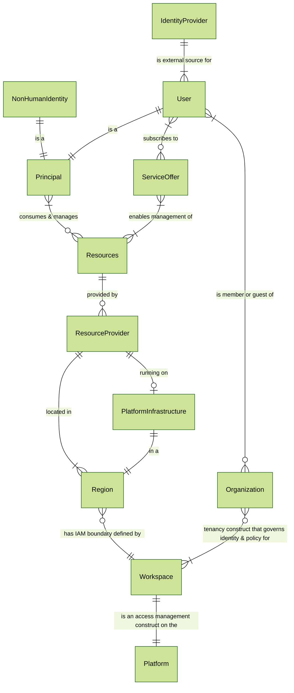

# HPE GreenLake Resource Notation (GRN)

## Executive Summary

In the context of Identity and Access Management (IAM), scope refers to the precise boundary or extent of an action, permission, or policy – defining which resource or set of resources an operation is intended to apply to.

The **HPE GreenLake Resource Notation (GRN)** is the standardized, URI-compatible syntax (`grn:glp/workspaces/...`) used to define and specify this scope within the HPE GreenLake platform. The GRN provides a unique, hierarchical identifier (encompassing platform instances, workspaces, regions, providers, and specific resources) that allows for precise targeting of resources.

For example:

* A GRN for a specific virtual machine defines a narrow scope limited to that VM.
* A GRN prefix for a workspace defines a broader scope encompassing all resources within that workspace.
* A GRN for a service provider within a region defines a scope covering resources managed by that provider in that location.


Key Use Cases:

* Unambiguous resource identification.
* Precisely specifying scope in HPE GreenLake IAM API calls.
* Defining policies where the resource's tenancy is critical.


Ultimately, the GRN is the essential tool for accurately communicating and enforcing the intended scope within the HPE GreenLake IAM system.

## GRN Syntax Specification

GRN provides a hierarchical taxonomy within HPE GreenLake for uniquely identifying resources, considering platform instances, tenancy (workspaces), regions, and service/resource providers.

### Synopsis


```text
# Workspace Scoped Resource:
grn:{platform-instance}/workspaces/{id}/regions/{name|default}/providers/{namespace}/{resource-type}/{id}

# Entire Workspace Scope:
grn:{platform-instance}/workspaces/{id}

# Platform Scoped Resource (not workspace specific):
grn:{platform-instance}/providers/{namespace}/{resource-type}/{id}
```

### Examples


```text
grn:glp/workspaces/123/regions/us-west/providers/backup-recovery/backups/1234123
 \ /\ /\_____________/\______________/\________________________________________/
  |   \       |               |                           |               |
Scheme |   Workspace        Region           Provider Namespace Path      |
       |  (if scoped)    (if regional)           (resource types)    (resource ID)
    Platform Instance: (typically glp)
```

**Workspace Scoped Regional Provider Resources:**

Resources which are defined within a workspace by a regional provider.


```text
# Regional Resource
grn:glp/workspaces/123/regions/us-west/providers/example-provider/example-resource-type/1234123

# Compute Ops Regional Resource
grn:glp/workspaces/123/regions/eu-central/providers/compute-ops/jobs/123123

# Aruba Regional Group
grn:glp/workspaces/123/regions/us-west/providers/aruba-central/group/0

# Data Services Group
grn:glp/workspaces/123/regions/us-west/providers/data-services/group/37908e
```

**Workspace Scoped Non-Regional Resources:**

Resources which are defined within a workspace and are not regional.

If a service is scoped to the same region as the "workspace", the
resource is in the workspace's 'default' region.


```text
# Non-Regional workspace scoped resource (IAM custom workspace role)
grn:glp/workspaces/123/regions/default/providers/authorization/custom-roles/123
```

**Entire Workspace:**

In the following IAM role assignment example, the assignment can be scoped to the entire workspace.


```text
# Full workspace (not scoped to a specific region or provider resource)
grn:glp/workspaces/123
```

**Platform Scoped Resources:**

Resources which are defined globally and not workspace specific.


```text
# Predefined role for Compute Ops Administrator
grn:glp/providers/authorization/roles/compute-ops-mgmt.administrator

# Registered service offer available in any workspace
grn:glp/providers/service-catalog/service-offer/123213
```

### Important Rules

* **Specificity**: GRNs referencing specific resources MUST be fully qualified and MUST NOT contain wildcards (*).
* **Wildcards**: APIs designed for search, filtering, or defining broad permissions (e.g., AuthZ scopes in role assignments) MAY utilize wildcards. The interpretation of wildcards is specific to the API using them and you must review the specific API docs.
  * Example Wildcard Usage (Conceptual): grn:glp/workspaces/123/regions/us-west/providers/backup-recovery/backups/* *might* represent all backups within that specific provider, workspace, and region, but you *MUST* review the specific API documentation.
* **Platform vs. Workspace Scope**:
  * *Platform Scoped Resources*: Resources defined at the platform level (available across workspaces, like predefined roles or global service offers) MUST NOT include the `workspaces/.../regions/...` segment.
  * *Workspace Scoped Resources*: Resources created within and managed by a specific workspace MUST include the `workspaces/{workspace-id}/regions/{region-name|default}` segment.


### Provider Namespaces & API Group Alignment

* All resources MUST be defined in a provider namespace.
* The provider namespace MUST be unique within a platform instance.
* The provider namespace SHOULD be the [registered API group](https://developer.greenlake.hpe.com/docs/greenlake/standards/ratified/api/api-groups/api-grp-registry/) providing the resource.


### URI Format Details

GRN maps directly to URI "scheme" and "path" elements:

* Scheme: `grn` (Note: This is a private scheme, not officially registered with IANA).
* Path: The hierarchical path identifying the specific resource or scope.


**URI Component Breakdown:**


```text
grn:    glp     /      workspaces/123/regions/us-west/providers/compute-ops/servers/abc
^       ^       ^      ^
scheme  path    path   more path elements...
        segment segment
```

**Hierarchical Structure:**

GRNs are constructed from relative scope segments to form an absolute path:


```text
absolute-scope = grn: relative-scope / relative-scope / ...
```

Scopes follow a parent-child hierarchy:


```text
/{parent-scope-type}/{parent-scope-id}/{child-scope-type}/{child-scope-id}/...
```

Each level adds specificity to the scope.

**GRN Segments Breakdown:**

The GRN path is composed of several key segments:


```text
grn: platform-instance + [/workspace + /resource region] + /provider namespace + /resource path
```

* `platform-instance`: Identifies the specific, top-level instance of the HPE GreenLake platform (e.g., `glp` for the standard commercial platform). This forms the root of the absolute scope. Note: While different platform instances exist, the specific platform instance identifier (e.g., glp) usually remains constant due to backwards compatibility considerations.
* `workspaces/{workspace-id}`: Included only for resources whose lifecycle is bound to a specific workspace.
* `resource-region` (Required if tenancy is present): Specifies the region associated with the resource within the workspace context.
  * `regions/{region-name}`: The specific region identifier (e.g., `us-west`, `eu-central`.
  * `regions/default`: Used for workspace-scoped resources that do not have distinct regional deployments separate from the workspace's primary region. It signifies the resource resides within the workspace's logical boundary without further regional specification.
* `provider-namespace`: Identifies the entity responsible for the resource type.
  * `providers/{provider-namespace}`: The namespace MUST be unique within the platform instance. It SHOULD align with the registered API group providing the resource (e.g., `compute-ops`, `backup-recovery`, `authorization`).
* `resource-path`: Identifies the specific resource within the provider
  * `{resource-type}/{resource-id}`: The type of resource (e.g., `jobs`, `backups`, `roles`) and its unique identifier within that type and provider namespace.


### Relationship Diagram

The following diagram illustrates relationships between Users, Service Offers, Resources, Resource Providers, Workspaces, Organizations, and the HPE GreenLake Platform:




### Definitions

**Scope:**
The set of resources identified by a GRN string, defining the boundary of what is being referenced.

**Service offer:**
A subscribable package of managed functionality offered to customers, delivered via one or more Resource Providers.

**Resources:**
Individual physical, virtual, or service items (e.g., servers, storage volumes, specific services) managed via a Resource Provider's API/UI.

**Service Provider:**
The entity that defines, registers, and manages customer-facing Service Offers. (also known as "Application").

**Resource Provider:**
The component that defines specific resource types and exposes APIs for managing instances of those resources (often within a Workspace).

**Workspace:**
An access management container within HPE GreenLake used to organize, manage, and control access to resources.

**Organization:**
A governance container within HPE GreenLake used to organize, manage, and control identity and other governance policies for multiple workspaces.

**Platform:**
The entire HPE GreenLake ecosystem, encompassing all Service Offers, Resource Providers, and the underlying infrastructure.

**Service Provider Instances:**
Deployed instances of the software/infrastructure implementing one or more Resource Providers, often specific to a region. (also known as "application instances")

**Platform Instance:**
The top-level identifier in a GRN (e.g., `glp`, `glp-xyz`). This is typically fixed to `glp`, but is reserved for potential future use to distinguish major, independent deployments of the HPE GreenLake Platform.

**Infrastructure & Runtime Environment:**
The underlying managed hardware and software services hosting Resource Providers and other platform components (e.g., Common Cloud Platform).

#### IAM Glossary

See also: [IAM Glossary](/docs/greenlake/services/iam/glossary)